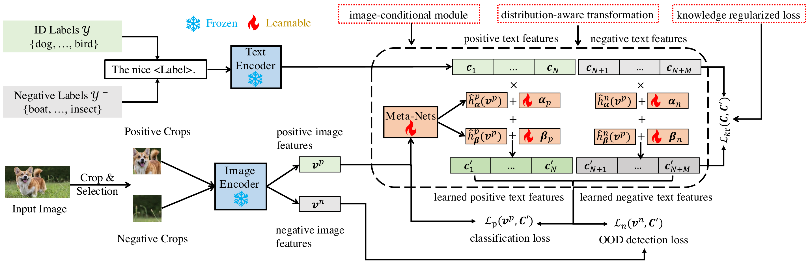
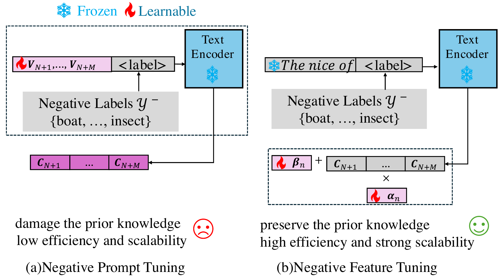
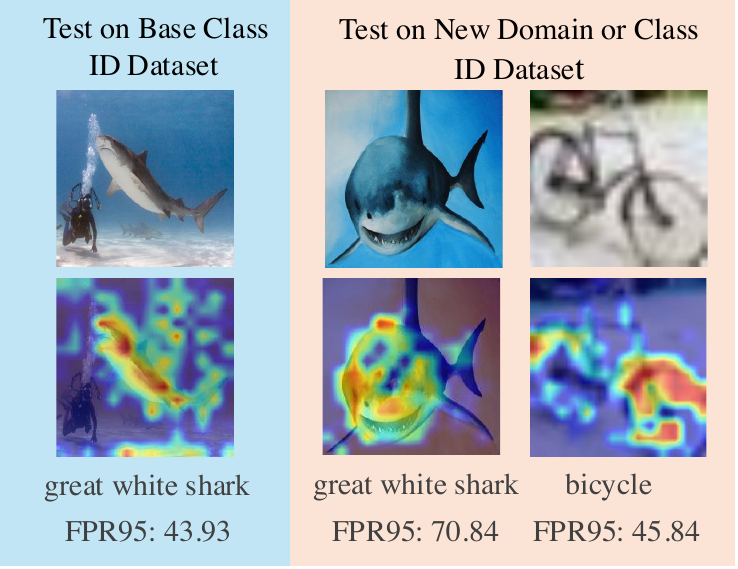
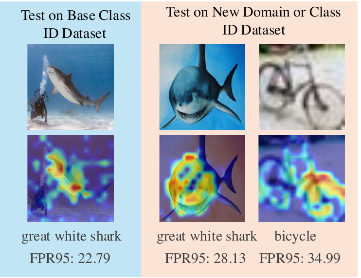
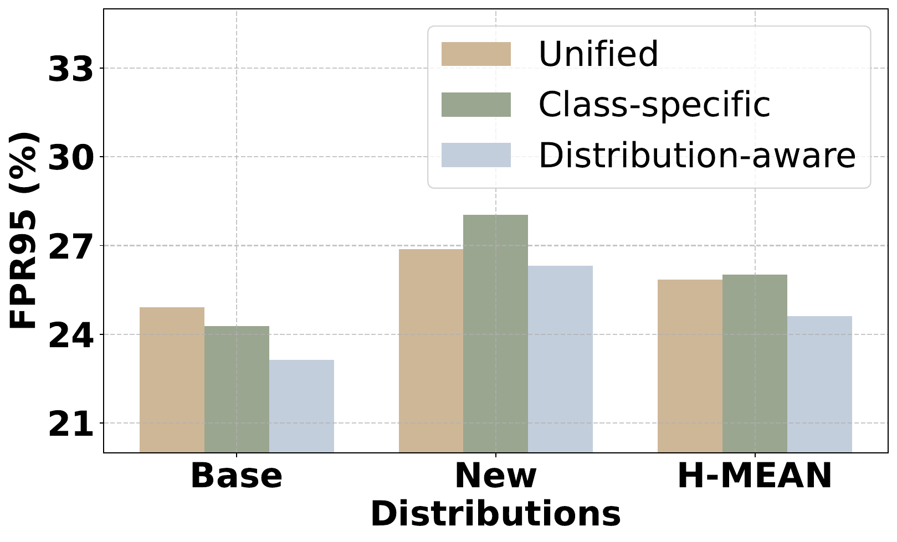
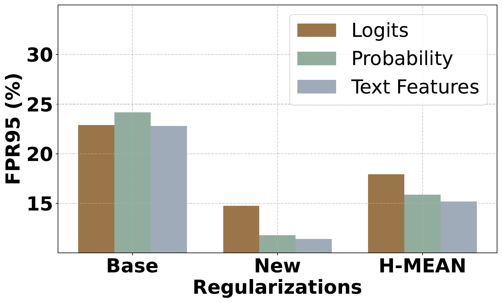
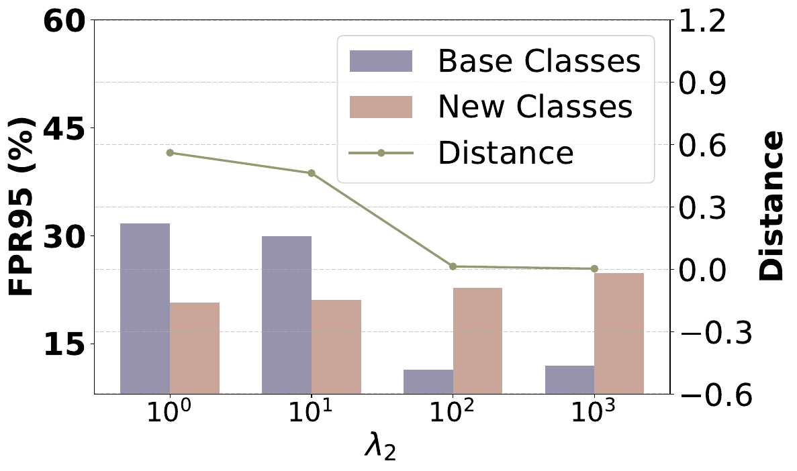
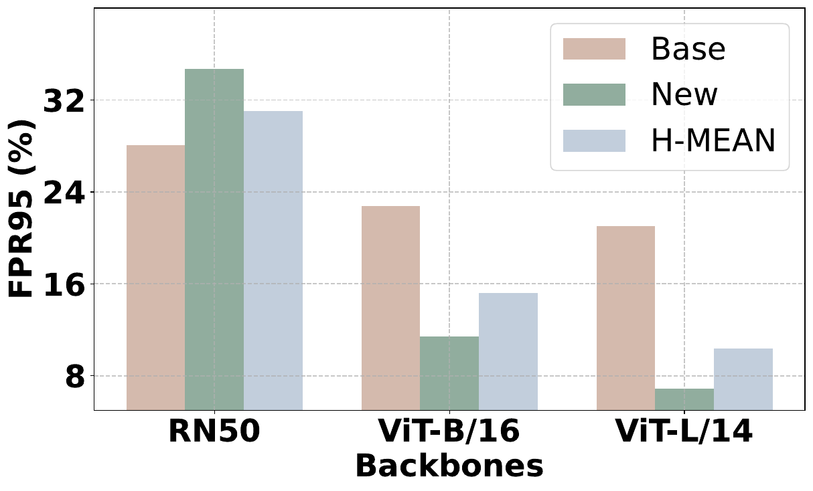
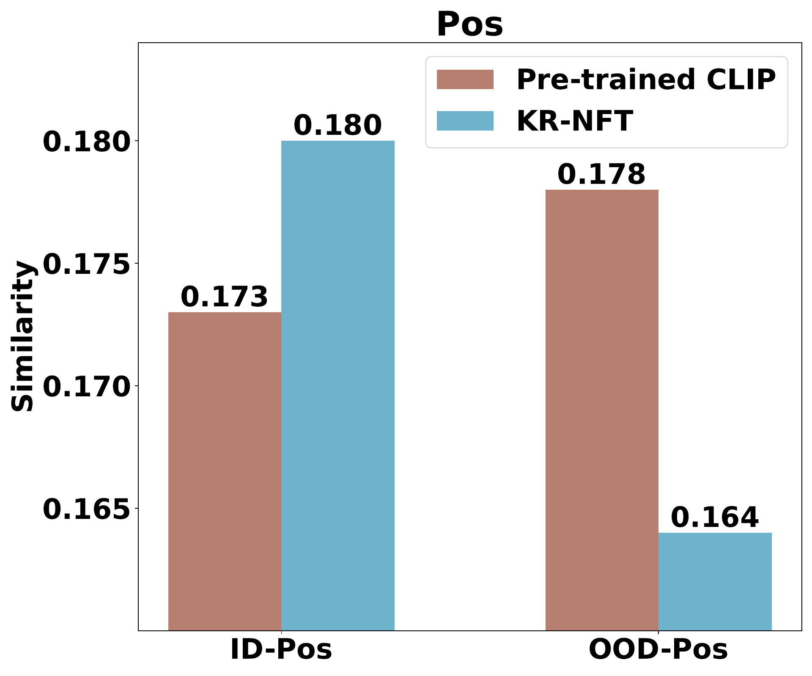
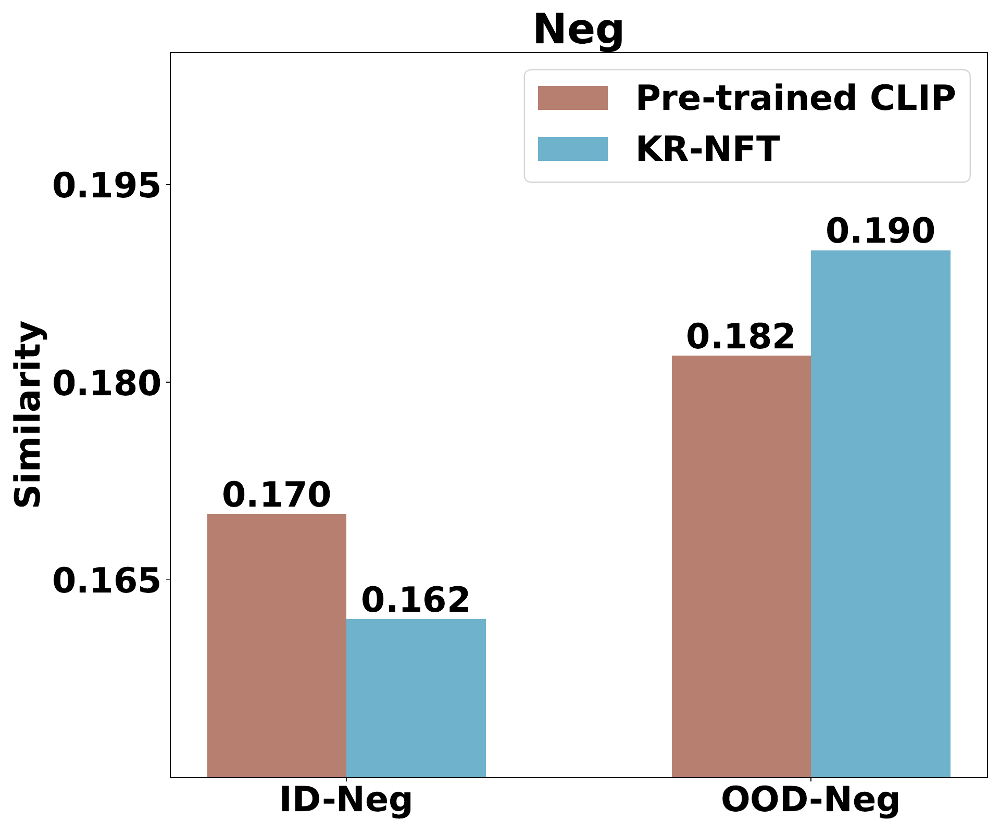

<div align="center">

# KR-NFT

### Knowledge Regularized Negative Feature Tuning of Vision-Language Models for Out-of-Distribution Detection

[](https://arxiv.org/abs/2507.19847)
[](https://doi.org/10.1145/3746027.3755120)
[](https://github.com/openai/CLIP)
[](https://github.com/Jingkang50/OpenOOD)

**Wenjie Zhu · Yabin Zhang · Xin Jin · Wenjun Zeng · Lei Zhang**

Official implementation of **KR-NFT**, accepted by **ACM Multimedia 2025**.

[Paper](https://arxiv.org/abs/2507.19847) · [Installation](#installation) · [Training](#training-and-evaluation) · [Results](#main-results) · [Citation](#citation)

</div>

---

## Overview

KR-NFT improves out-of-distribution detection without discarding the knowledge already encoded by a pre-trained vision-language model. Instead of rebuilding text features through expensive prompt tuning, it learns lightweight, image-conditional transformations directly in the text-feature space.

<div align="center">
  
  <br>
  <sub><b>KR-NFT framework.</b> Positive and negative crops supervise distribution-aware feature tuning, while knowledge regularization preserves the original CLIP representation.</sub>
</div>

<br>

| Negative Feature Tuning | Image-conditional Adaptation | Knowledge Regularization |
| :---: | :---: | :---: |
| Directly scales and shifts frozen text features. | Meta-networks generate instance-dependent residuals. | Tuned features stay close to pre-trained CLIP features. |
| No text-encoder back-propagation. | More robust to unseen classes and styles. | Reduces catastrophic knowledge forgetting. |

## Motivation

Traditional negative prompt tuning needs to forward and optimize prompt tokens through the text encoder. KR-NFT operates directly on pre-trained text features, preserving prior knowledge while improving efficiency and scalability.

<div align="center">
  
</div>

The learned feature transformation is conceptually simple:

```text
tuned_feature = L2((base_scale + image_scale) * frozen_feature
                   + base_shift + image_shift)
```

Separate transformations are maintained for positive ID labels and negative OOD proxies. The complete objective is:

```text
L = L_positive + lambda_1 * L_negative + lambda_2 * L_knowledge
```

## Generalization

Existing prompt-tuned models can improve the training classes while degrading on unseen classes or domains. KR-NFT retains foreground activation across class and style shifts and suppresses ID-irrelevant regions.

<table>
  <tr>
    <td align="center" width="50%"><b>Pre-trained CLIP</b></td>
    <td align="center" width="50%"><b>KR-NFT</b></td>
  </tr>
  <tr>
    <td></td>
    <td></td>
  </tr>
  <tr>
    <td align="center">Strong base representation, but vulnerable to irrelevant features and domain shifts.</td>
    <td align="center">More focused activation and lower FPR95 on base, unseen-domain, and unseen-class data.</td>
  </tr>
</table>

## Main Results

Experiments use a **ViT-B/16** encoder, **four ImageNet shots per class**, **256 crops per image**, and **10,000 negative text labels**.

| Setting | Previous Best FPR95 | KR-NFT FPR95 | Improvement |
| --- | ---: | ---: | ---: |
| Unseen classes | 40.43 | **34.99** | **5.44 ↓** |
| Unseen styles | 44.90 | **28.13** | **16.77 ↓** |
| OpenOOD Far-OOD | 25.40 | **19.08** | **6.32 ↓** |

<details>
<summary><b>Detailed unseen-class results</b></summary>

| Method | CIFAR-10 AUROC | CIFAR-10 FPR95 | CIFAR-100 AUROC | CIFAR-100 FPR95 | Fine-grained AUROC | Fine-grained FPR95 |
| --- | ---: | ---: | ---: | ---: | ---: | ---: |
| LAPT | 95.21 | 17.26 | 78.94 | 57.11 | 89.23 | 46.91 |
| **KR-NFT** | **96.82** | **11.41** | **80.95** | **53.24** | **89.99** | **40.33** |

</details>

<details>
<summary><b>Detailed unseen-style results</b></summary>

| Method | ImageNet-S FPR95 | ImageNet-A FPR95 | ImageNet-R FPR95 | ImageNet-V2 FPR95 | Average FPR95 |
| --- | ---: | ---: | ---: | ---: | ---: |
| LAPT | 51.87 | 51.47 | 47.42 | 28.84 | 44.90 |
| **KR-NFT** | **24.81** | **38.46** | **20.12** | **29.13** | **28.13** |

</details>

## Analysis

<table>
  <tr>
    <td align="center" width="50%"><b>Distribution-aware transformation</b></td>
    <td align="center" width="50%"><b>Knowledge regularization target</b></td>
  </tr>
  <tr>
    <td></td>
    <td></td>
  </tr>
  <tr>
    <td align="center">Independent ID/OOD transformations outperform unified and class-specific alternatives.</td>
    <td align="center">Regularizing text features provides the best base/new-class balance.</td>
  </tr>
</table>

<table>
  <tr>
    <td align="center" width="50%"><b>Knowledge weight λ₂</b></td>
    <td align="center" width="50%"><b>Backbone scaling</b></td>
  </tr>
  <tr>
    <td></td>
    <td></td>
  </tr>
  <tr>
    <td align="center">λ₂ = 100 balances new-task adaptation and pre-trained knowledge retention.</td>
    <td align="center">Larger VLM backbones further improve base and generalization performance.</td>
  </tr>
</table>

<details>
<summary><b>Positive and negative feature similarity analysis</b></summary>

<table>
  <tr>
    <td></td>
    <td></td>
  </tr>
</table>

KR-NFT increases ID-to-positive alignment, decreases OOD-to-positive alignment, decreases ID-to-negative alignment, and increases OOD-to-negative alignment.

</details>

## Installation

This repository extends OpenOOD-VLM. Install the upstream runtime first:

```bash
pip install git+https://github.com/YBZH/OpenOOD-VLM
```

The supplied scripts expect an OpenOOD-VLM workspace containing `main.py`. A CUDA-capable PyTorch environment is required for the full CLIP experiment.

## Data Preparation

```text
data/
├── benchmark_imglist/
├── images_classic/
└── images_largescale/
results/
└── checkpoints/
```

The paper evaluates ImageNet-1K against iNaturalist, SUN, Places, Textures, CIFAR-10, CIFAR-100, fine-grained datasets, ImageNet-Sketch, ImageNet-A, ImageNet-R, and ImageNet-V2. Follow the [OpenOOD download instructions](https://github.com/Jingkang50/OpenOOD/tree/main/scripts/download); ImageNet training images must be obtained from the official source.

## Training and Evaluation

The default configuration follows the paper: four shots, 256 random crops, 32 selected positive/negative crops, three AdamW epochs, learning rate `1e-5`, `lambda_1=0.3`, and `lambda_2=100`.

```bash
# Train
bash scripts/ood/krnft/krnft_shot4_train.sh

# Evaluate an existing checkpoint
bash scripts/ood/krnft/krnft_shot4_test.sh
```

The primary configuration files are:

| Component | Configuration |
| --- | --- |
| Network | `configs/networks/krnft.yml` |
| Training objective | `configs/pipelines/train/train_krnft.yml` |
| Crop augmentation | `configs/preprocessors/randcrop_preprocessor.yml` |
| ImageNet/OOD benchmark | `configs/datasets/imagenet/imagenet_traditional_four_ood.yml` |

## Code Structure

```text
openood/
├── networks/
│   ├── clip_krnft.py          # CLIP wrapper and text-feature construction
│   └── krnft_modules.py       # Distribution-aware image-conditional NFT
├── trainers/
│   ├── krnft_components.py    # Crop selection, grouped logits, KR-NFT losses
│   └── krnft_trainer.py       # Optimization and checkpointing
└── pipelines/
    └── train_krnft_pipeline.py
```

## Citation

```bibtex
@inproceedings{zhu2025krnft,
  title     = {Knowledge Regularized Negative Feature Tuning of Vision-Language Models for Out-of-Distribution Detection},
  author    = {Zhu, Wenjie and Zhang, Yabin and Jin, Xin and Zeng, Wenjun and Zhang, Lei},
  booktitle = {Proceedings of the 33rd ACM International Conference on Multimedia},
  year      = {2025},
  doi       = {10.1145/3746027.3755120},
  eprint    = {2507.19847},
  archivePrefix = {arXiv}
}
```

## Acknowledgements

This project builds on [OpenOOD](https://github.com/Jingkang50/OpenOOD), [OpenOOD-VLM](https://github.com/YBZH/OpenOOD-VLM), and [CLIP](https://github.com/openai/CLIP).

<div align="center">
  <sub>If this work is useful for your research, please consider citing the paper.</sub>
</div>
